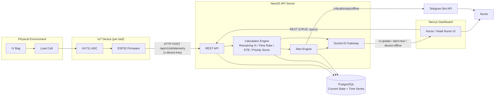
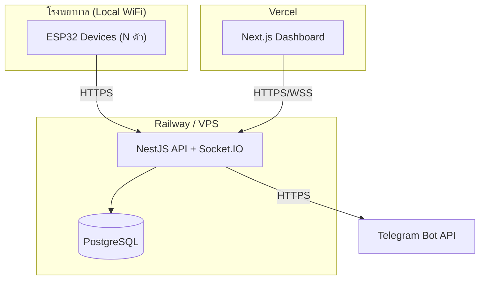

# High Level Architecture — SMIS

> เดิมไฟล์นี้ว่าง — เอกสารนี้ทำหน้าที่เป็น **"80,000 ft view"** เดียวที่รวบรวมภาพรวมจาก [[Application Architecture]], [[IoT Architecture]], [[Hardware & Firmware Architecture]] (ซึ่งแต่ละไฟล์มี high-level diagram ของตัวเองแยกกัน) เข้าเป็นภาพเดียว พร้อมเติมส่วน Deployment Topology ที่ยังไม่มีที่ไหนระบุไว้ (`Deployment Architecture.md` ยังว่าง) — รายละเอียดเชิงลึกของแต่ละ Layer ยังคงอยู่ในเอกสารต้นทางเดิม ไม่ย้ายมาที่นี่เพื่อไม่ให้ต้อง sync สองที่

**อ่านคู่กับ:** [[API Specification|API]] (API Contract) · [[Database]] (Schema) · [[Detailed Design]] (module/algorithm/sequence-level)

---

# 1. Architectural Positioning

จาก [[Project Requirement Document (PRD) v2.1]] §4 — SMIS วางเป็น 4 Layer:

```text
┌────────────────────────────────────────────┐
│ Clinical Workflow Intelligence             │  ← Priority Queue / Analytics / AI (Phase 3+)
├────────────────────────────────────────────┤
│ Real-time Monitoring Platform               │  ← Dashboard / Alerts / Ward Overview
├────────────────────────────────────────────┤
│ IoT Data Layer                              │  ← Weight / Flow / Battery / Device Status
├────────────────────────────────────────────┤
│ Physical Environment                        │  ← IV Bag / IV Stand / Patient Bed
└────────────────────────────────────────────┘
```

เอกสารนี้อธิบาย **Real-time Monitoring Platform + IoT Data Layer** เป็นหลัก (ขอบเขต MVP) — Clinical Workflow Intelligence (AI/Predictive) เป็น Phase 3+ ตาม [[Feature List]] FL-026/FL-027

---

# 2. High-Level Component Diagram



---

# 3. Component Responsibilities

| Component | หน้าที่หลัก | รายละเอียดเชิงลึก |
|---|---|---|
| **ESP32 Firmware** | อ่านค่า Load Cell ผ่าน HX711, กรอง Noise, ส่ง Telemetry ทุก 5–10s | [[Hardware & Firmware Architecture]] |
| **NestJS API — REST Layer** | รับ Request จาก Dashboard และ Device, validate, route ไป module ที่เกี่ยวข้อง | โครงสร้าง module: `ward/ bed/ iv/ alert/ device/ notification/ socket/ prisma/ common` — [[Application Architecture]] §Backend Modules |
| **Calculation Engine** | คำนวณ Remaining %/ml, Flow Rate (หลัง smoothing), ETE, Priority Score | สูตรและ pseudocode เต็มอยู่ใน [[Detailed Design]] §2 |
| **Alert Engine** | ตรวจเงื่อนไข Critical/Empty/Device Offline/Occlusion, debounce ก่อนสร้าง alert | [[Detailed Design]] §2.6, FL-028–033 |
| **Socket.IO Gateway** | Broadcast event `iv:update` / `alert:new` / `device:offline` ไป Client ที่ subscribe | [[Detailed Design]] §3.1 |
| **PostgreSQL** | เก็บ Current State (`iv_status`) แยกจาก Historical Time Series (`iv_readings`) เพื่อลด write load | [[Database]] |
| **Telegram Bot** | Notification Channel MVP สำหรับ Critical/Empty/Offline Alert | FL-031, PRD §10.8 |
| **Next.js Dashboard** | Nurse-facing UI: Dashboard/Ward/Bed/Alert/Device/Analytics | [[Application Architecture]] §Frontend Modules |

---

# 4. Technology Stack (Summary)

| Layer | Technology | อ้างอิง |
|---|---|---|
| Frontend | Next.js 15, TypeScript, TailwindCSS, shadcn/ui, Recharts, Socket.IO Client | PRD §15.1 |
| Backend | NestJS, Prisma ORM, Socket.IO | PRD §15.1 |
| Database | PostgreSQL | [[Database]] |
| IoT | ESP32, HX711, Load Cell (1kg MVP / 2kg Production) | [[Hardware & Firmware Architecture]] |
| Notification | Telegram Bot API (MVP) → LINE OA/Email/Push (Phase 2/3) | FL-031/035–037 |
| Infrastructure | Docker (local/dev), Vercel (Frontend), Railway หรือ VPS (Backend) | §5 |

> รายละเอียด version/library เพิ่มเติม ดู [[Application Architecture]] §Technology Stack — ไม่ duplicate ที่นี่

---

# 5. Deployment Topology

> `013 Architecture/Deployment Architecture.md` ยังว่าง — เนื้อหานี้เป็นจุดเริ่มต้นระดับ MVP จนกว่าจะแยกเป็นเอกสารเต็มถ้าจำเป็น

## 5.1 MVP Deployment (Hackathon / Pilot)



## 5.2 Environment Separation

| Environment | Frontend | Backend | Database | หมายเหตุ |
|---|---|---|---|---|
| Local Dev | `next dev` | `nest start --watch` (Docker Compose) | PostgreSQL (Docker container) | ตาม FL-001 Dev Environment & CI |
| Staging/Demo | Vercel Preview | Railway/VPS Staging | PostgreSQL (managed หรือ container) | ใช้ทดสอบก่อน Demo/Pilot |
| Production (Post-MVP) | Vercel Production | VPS (dedicated) + reverse proxy (HTTPS) | PostgreSQL (managed, มี Backup) | ต้องผ่าน Regulatory Gate ก่อน (PRD §13.5) |

## 5.3 Network & Security Boundary

```text
ESP32 ──(HTTPS + x-device-key)──> API Server ──(internal)──> PostgreSQL
Dashboard ──(HTTPS + JWT)──────> API Server
API Server ──(HTTPS, outbound)──> Telegram Bot API
```

- MVP: Device authentication ผ่าน static API Key (`x-device-key`), Web authentication ผ่าน JWT/Session (FL-003)
- Production: ยกระดับเป็น JWT Device Token + Certificate Authentication (PRD §11.6) — ดู [[Hardware & Firmware Architecture]] §Security

---

# 6. High-Level Data Flow

```text
1. ESP32 อ่านค่า Load Cell → กรอง Noise (Moving Average)
2. ส่ง Telemetry → POST /api/v1/iot/telemetry (ทุก 5–10s ปกติ, ทันทีถ้า Critical/Empty/Offline)
3. API บันทึก iv_readings (history) + อัปเดต iv_status (current state)
4. Calculation Engine คำนวณ Remaining %/ml, Flow Rate, ETE, Priority Score
5. Alert Engine ตรวจเงื่อนไข → สร้าง alert ถ้าเข้าเงื่อนไข (พร้อม debounce)
6. Socket.IO Broadcast: iv:update / alert:new / device:offline
7. Dashboard อัปเดตทันทีโดยไม่ต้อง Polling (< 10 วินาที end-to-end, PRD §11.1)
8. ถ้า Critical/Empty/Offline → ส่ง Telegram Notification เพิ่มเติม
```

รายละเอียด step-by-step พร้อม sequence diagram อยู่ใน [[Detailed Design]] §3

---

# 7. Non-Functional Architecture Drivers

| Driver | Requirement | ผลต่อ Architecture |
|---|---|---|
| Latency | Dashboard อัปเดต < 10s (PRD §11.1) | เลือก Socket.IO push แทน polling; แยก Current State/History table |
| Scalability | รองรับ 100+ Device พร้อมกัน (PRD §11.7) | Edge filtering ที่ ESP32 ลด write rate; index บน `last_seen`, `priority_score` |
| Reliability | Alert Accuracy > 95%, Device Uptime > 99% (PRD §12.1) | Debounce logic ใน Alert Engine, Offline detection ด้วย `last_seen` threshold |
| Security | Device API Key + HTTPS (MVP) → JWT Device Token + Cert (Production) (PRD §11.6) | Auth boundary แยกระหว่าง Device-facing endpoint กับ Web-facing endpoint |
| Extensibility | "Keep the Device Simple, Keep the Server Smart" (PRD §15.4) | Logic ทั้งหมด (คำนวณ/แจ้งเตือน/วิเคราะห์) อยู่ฝั่ง Server เพื่อปรับได้โดยไม่ flash firmware ใหม่ |

---

# 8. Scope Boundary — เอกสารนี้ครอบคลุมอะไร

| ครอบคลุม | ไม่ครอบคลุม (ดูเอกสารอื่น) |
|---|---|
| Component-level diagram, responsibility, deployment topology | Pin mapping, firmware module, calibration flow → [[Hardware & Firmware Architecture]] |
| Data flow ระดับสูง | Payload/topic design เชิงลึก, MQTT (Phase 2) → [[IoT Architecture]] |
| Technology stack summary | Frontend/Backend module folder structure เต็ม → [[Application Architecture]] |
| — | API endpoint contract → [[API Specification\|API]] |
| — | Table/column/enum detail → [[Database]] |
| — | Algorithm pseudocode, sequence diagram, state machine → [[Detailed Design]] |

---

## Related

- [[Project Requirement Document (PRD) v2.1]]
- [[Application Architecture]]
- [[IoT Architecture]]
- [[Hardware & Firmware Architecture]]
- [[Database]]
- [[ER-Diagram]]
- [[API Specification|API]]
- [[Detailed Design]]
- [[Feature List]]
