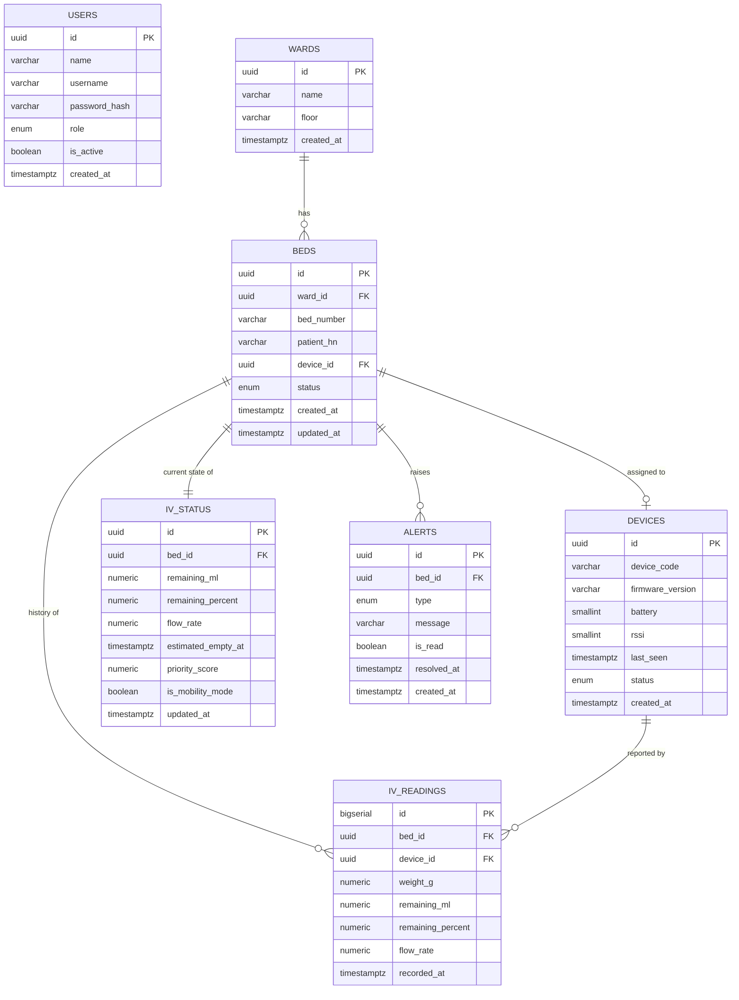

# ER Diagram — SMIS

> Visual companion ของ [[Database]] — field-level detail, enum values, และคำอธิบายเหตุผลแต่ละ column อยู่ในเอกสารนั้น ไฟล์นี้เก็บเฉพาะ diagram + relationship summary เพื่อไม่ให้ต้อง sync เนื้อหาสองที่

---

# Relationship Summary

| From | To | Cardinality | หมายเหตุ |
|---|---|---|---|
| `wards` | `beds` | 1 : N | Ward หนึ่งมีหลายเตียง |
| `beds` | `devices` | 1 : 0..1 | เตียงผูก device ได้อย่างมากหนึ่งตัว ณ ขณะหนึ่ง — `beds.device_id` nullable |
| `beds` | `iv_status` | 1 : 1 | Current state ต่อเตียง 1 แถวเสมอ |
| `beds` | `iv_readings` | 1 : N | ประวัติ telemetry ทั้งหมดของเตียง (time-series, append-only) |
| `devices` | `iv_readings` | 1 : N | ใช้ตรวจสอบว่า reading มาจาก device ตัวไหน (รองรับกรณีเปลี่ยน device ระหว่างทาง) |
| `beds` | `alerts` | 1 : N | เตียงหนึ่งมี alert ได้หลายรายการ (เก่า+ใหม่) |

`users` ไม่มีเส้นสัมพันธ์กับ entity อื่นใน MVP scope (ดูเหตุผลใน [[Database]] §4)

---

## Related

- [[Database]]
- [[Application Architecture]]
- [[Project Requirement Document (PRD) v2.1]]
