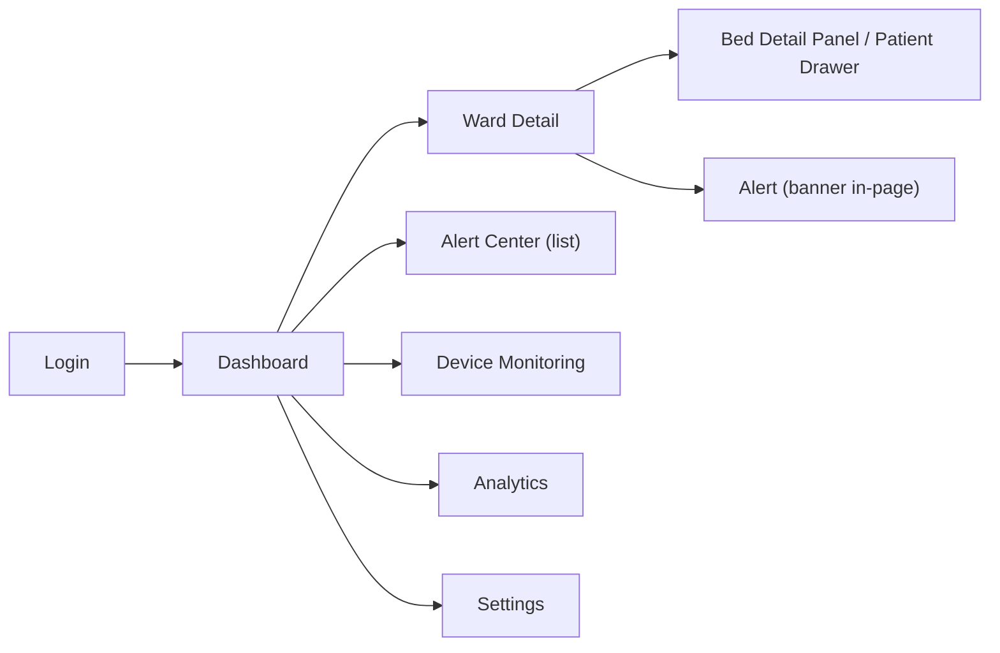

# UX/UI Design — SMIS

> เดิมไฟล์นี้ว่าง — เนื้อหานี้ extract Design Token จริงจาก mockup ที่มีอยู่แล้ว (`Main.dc.html`, `ward-detail-critical-alert.html`) ให้เป็น Design System ที่อ่านง่าย พร้อม UX Flow ระดับ user journey จาก [[Sprint List]] Phase 3 §UX Flow

---

# 1. Design Language

**Theme:** Dark, clinical-modern, low visual noise เพื่อลด Cognitive Load ตาม Core Product Principle (PRD §18)

| Token | ค่า | ใช้ที่ไหน |
|---|---|---|
| Background — App | `#07080d` | พื้นหลังหลักทั้งหน้า |
| Background — Panel/Sidebar | `rgba(255,255,255,0.025)` + `backdrop-filter: blur(24px)` | Sidebar, Card |
| Text — Primary | `#f4f6fb` / `#f6f8fc` | Heading, ตัวเลขสำคัญ |
| Text — Secondary | `#8891a3` / `#7c879c` / `#8792a6` | Label, timestamp, meta |
| Accent — Brand (templated) | `{{accent}}` (purple, ประมาณ `#7c6cff`), hover `#9d8cff` / `#b9adff` | Sidebar active state, Priority Score header, link |
| Accent — Secondary (cyan) | `#4de3ff` | Avatar gradient, highlight |
| Font — Display/Numeric | `Space Grotesk` (500/600/700) | KPI number, Bed No., Logo |
| Font — Body | `Plus Jakarta Sans` (400–700) | เนื้อหาทั่วไป |

## 1.1 Status Color (ใช้จริงใน mockup)

| Status | สี (soft) | สี (strong) | Background Tint |
|---|---|---|---|
| Critical | `#ff8a97` | `#f5455c` | `#ffe2e5` |
| Warning | `#ffb578` | — | `#ffe9cf` |
| Normal | `#86eec1` | — | `#dafbe9` |

⚠️ **Gap ที่ต้องปิดก่อน implement จริง:** PRD §10.7 กำหนด IV Color Band ไว้ **5 ระดับ** (Green 70–100% / Yellow 40–69% / Orange 10–39% / Red 1–9% / Gray 0% Empty) แต่ mockup ปัจจุบันออกแบบไว้แค่ **3 tier visual** (Critical แดง / Warning ส้ม / Normal เขียว) ยังไม่มี Yellow tier และ Gray (Empty) tier แยกจาก Critical — ต้องเพิ่ม token สีให้ครบ 5 ระดับก่อนขึ้น High-Fidelity จริงทุกหน้า

---

# 2. Component Inventory (จาก Mockup ที่มีอยู่)

| Component | ใช้ที่ | รายละเอียด |
|---|---|---|
| Sidebar Nav Item | ทุกหน้า | Icon + Label, active state = พื้นหลัง accent จาง + ตัวหนา |
| KPI Card | Dashboard, Ward Detail | ตัวเลขใหญ่ Space Grotesk gradient text + label เล็กด้านล่าง |
| Critical Alert Banner | Ward Detail | พื้นหลังแดงจาง, border แดง, pulse animation (`pulseGlow`, `ping`) เพื่อดึงสายตา |
| Priority List Row | Ward Detail | Bed No. + % + priority indicator, เรียงจากคะแนนสูงสุด |
| Bed Detail Panel | Ward Detail | สรุปข้อมูลเตียงที่เลือก: %, ETE, ml, flow rate, last updated, device |
| Status Badge (pill) | หลายที่ | `border-radius:999px`, สีตาม status |
| Avatar | Topbar, Sidebar | วงกลม gradient cyan→accent, ตัวอักษรย่อชื่อ |

---

# 3. Animation & Motion

| Effect | ใช้ที่ | ความหมาย |
|---|---|---|
| `pulseGlow` (box-shadow pulse สีแดง) | Critical Alert element | ดึงความสนใจไปที่ alert ที่ยัง unresolved |
| `ping` (scale+fade) | จุด indicator ข้าง alert | สื่อว่า "live/กำลังเกิดขึ้นตอนนี้" |
| `bannerPulse` (opacity pulse) | ข้อความใน Alert Banner | เน้นข้อความสำคัญโดยไม่ต้องใช้เสียง |

**หลักการ:** ใช้ motion เฉพาะจุดที่ต้องการดึงสายตาไปที่ Critical/Empty Alert เท่านั้น — ไม่ใช้ animation ฟุ่มเฟือยในส่วนอื่นเพื่อไม่ให้รบกวนสมาธิพยาบาล (สอดคล้องกับ Core Product Principle, PRD §18)

---

# 4. UX Flow (จาก [[Sprint List]] Phase 3 §UX Flow)



## 4.1 Primary Flow — Nurse ตอบสนอง Critical Alert (ตรงกับ [[User Journey - Critical IV Alert Response]])

```text
1. พยาบาลกำลังทำงานอื่น
2. ได้รับ Telegram Notification (Critical Alert)
3. เปิด Dashboard → เห็น Critical Alert Banner บน Ward Detail ทันที (สี pulse แดง)
4. ดู Priority Score list → เตียง Critical อยู่บนสุดเสมอ
5. กดดูเตียงนั้น → Bed Detail Panel แสดง Remaining/ETE/Flow Rate/Device
6. เดินไปเปลี่ยนถุงน้ำเกลือ → กลับมา mark alert เป็น resolved
```

## 4.2 Interaction Principle

- **1-tap ให้ได้มากที่สุด** — เช่น Mobility Mode ต้องเป็นปุ่มเดียว (FL-034, PRD §10.10 open question) เพื่อไม่ให้พยาบาลข้ามขั้นเพราะ interaction เยอะเกินไป
- **Priority-first** — ข้อมูลที่สำคัญที่สุด (เตียง Critical) ต้องอยู่บนสุดของหน้าจอเสมอ ไม่ต้อง scroll หา
- **ไม่เพิ่ม Cognitive Load** — ใช้สีและตำแหน่งสื่อความหมาย ไม่ต้องอ่านข้อความยาวเพื่อเข้าใจสถานะ

---

# 5. Responsive / Device Target (MVP)

MVP mockup ออกแบบที่ **1600×960 (Desktop/Nurse Station Monitor)** เป็นหลัก — ยังไม่มี breakpoint สำหรับ Tablet/Mobile ในเอกสารนี้ ถ้าต้องรองรับ Tablet (เช่นพยาบาลถือเดินตรวจ) ต้องเพิ่ม responsive design ใน Sprint ถัดไป (ไม่อยู่ใน Feature List ปัจจุบัน — ควรเพิ่มเป็น Feature ใหม่ถ้าต้องการ)

---

## Related

- [[Wireframe]]
- [[Prototype]]
- [[User Journey - Critical IV Alert Response]]
- [[Feature List]]
- [[Sprint List]]
- [[Project Requirement Document (PRD) v2.1]]
