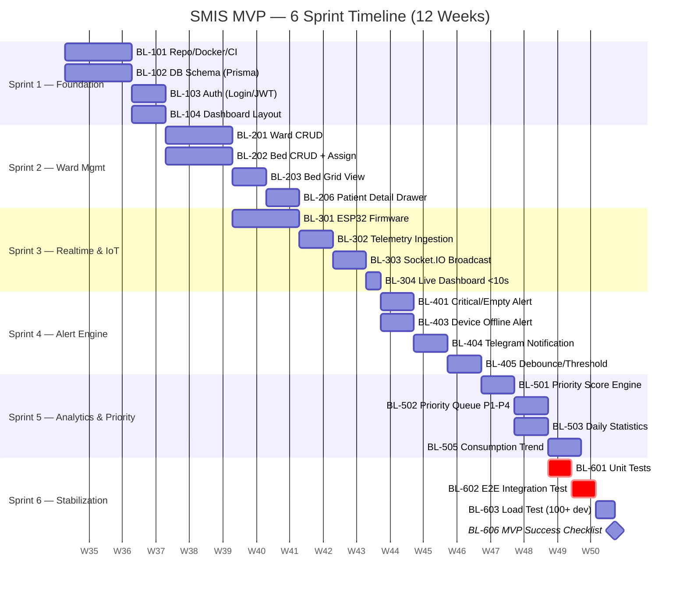
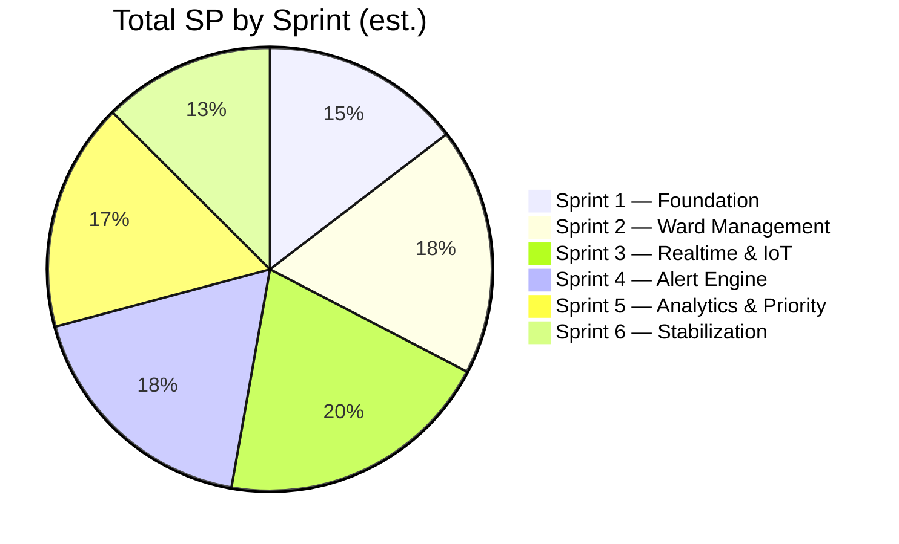

# Product Backlog — SMIS

> ที่มา: แตกจาก Functional/Non-Functional Requirements ใน [[Project Requirement Document (PRD) v2.1]] และจัดเข้า Sprint ตาม [[Phase Plan]] (Sprint 1–6, 2 สัปดาห์/Sprint) แต่ละ item อ้าง FR-ID กลับไปที่ PRD เพื่อไม่ให้หลุด sync กัน

**Priority scale:** P0 = ขาดไม่ได้สำหรับ MVP Demo · P1 = สำคัญสำหรับ MVP แต่ยอมลดสโคปได้ · P2 = Phase 2 (Pilot) · P3 = Phase 3+ (Scale/AI)

**Estimate:** Story Points (Fibonacci: 1,2,3,5,8,13) — ⚠️ เป็นค่าประมาณเริ่มต้น ทีมควร re-estimate ใน Sprint Planning จริง

---

# 0. Backlog Summary

| Sprint | Theme | P0 Items | P1 Items | Total SP (est.) |
|---|---|---|---|---|
| Sprint 1 | Foundation | 5 | 1 | 21 |
| Sprint 2 | Ward Management | 6 | 1 | 26 |
| Sprint 3 | Realtime & IoT | 5 | 1 | 29 |
| Sprint 4 | Alert Engine | 5 | 2 | 26 |
| Sprint 5 | Analytics & Priority | 5 | 1 | 24 |
| Sprint 6 | Stabilization | 4 | 2 | 18 |
| Backlog (Icebox) | Phase 2–3 | — | — | — |

## 0.1 Sprint Timeline

> วันที่เป็นสมมติฐาน (Sprint 1 เริ่ม = Week 1 ตาม [[Development Plan]] — ยังไม่มี Start Date จริงที่ fix) ใช้เพื่อแสดงลำดับ/ระยะเวลาเท่านั้น ทีมต้อง re-anchor วันที่จริงตอน Sprint 0 Kickoff

## 0.2 Story Point Distribution

---

# Sprint 1 — Foundation

| ID | User Story | FR Ref | Priority | SP | Acceptance Criteria |
|---|---|---|---|---|---|
| BL-101 | As a System Admin, I want to set up the project repo, Docker, and CI so that the team has a consistent dev environment | §15.1 | P0 | 3 | Docker compose รันได้ทั้ง Frontend/Backend/DB ในเครื่อง dev |
| BL-102 | As a System Admin, I want PostgreSQL + Prisma schema initialized so that core entities exist | §15.3 | P0 | 5 | Migration รันสำเร็จ, entities: wards, beds, iv_status, alerts, devices |
| BL-103 | As a User, I want to log in with username/password so that only authorized staff access the dashboard | §11.6 | P0 | 5 | Login/Logout ทำงาน, session/JWT ถูกต้อง |
| BL-104 | As a Nurse, I want a dashboard layout with sidebar navigation so that I can navigate Wards/Devices/Alerts/Analytics/Settings | §10.1 | P0 | 5 | Sidebar 7 เมนูตาม PRD §10.1 ใช้งานได้ (แม้หน้าในยังเป็น placeholder) |
| BL-105 | As a System Admin, I want a Dashboard skeleton with mock KPI cards so that layout is validated early | §10.1 | P0 | 3 | KPI card 6 ตัวแสดงผลได้จาก mock data |
| BL-106 | As a Developer, I want basic error logging/monitoring wired up so that issues are traceable from Sprint 1 | §11.6 | P1 | 2 | Log แสดง error หลักได้ (console/log file พอสำหรับ MVP) |

---

# Sprint 2 — Ward Management

| ID | User Story | FR Ref | Priority | SP | Acceptance Criteria |
|---|---|---|---|---|---|
| BL-201 | As a System Admin, I want to CRUD Wards so that hospital structure can be configured | §10.2 | P0 | 5 | สร้าง/แก้/ลบ Ward ได้, แสดง Total/Critical/Warning/Normal Beds |
| BL-202 | As a System Admin, I want to CRUD Beds and assign Patient HN + Device so that each bed maps to a real patient/device | §10.2, §15.3 | P0 | 5 | Bed ผูกกับ Ward, HN, Device ID ได้ |
| BL-203 | As a Nurse, I want a Bed Grid view per Ward showing %, ml, ETE so that I see all beds at a glance | §10.2, §10.3 | P0 | 5 | Bed Grid แสดงข้อมูลตาม spec §10.3 (mock data ได้ใน sprint นี้) |
| BL-204 | As a Nurse, I want to sort beds by Remaining %/ml/ETE/Bed No./Priority Score so that I can triage quickly | §10.2 | P0 | 3 | Sort ทำงานถูกต้องทุก field |
| BL-205 | As a Nurse, I want to filter beds by Critical/Warning/Normal/Offline so that I can focus on what matters | §10.2 | P0 | 3 | Filter ทำงานถูกต้องทุก status |
| BL-206 | As a Nurse, I want to open a Patient Detail Drawer from a bed card so that I see IV info and history | §10.3 | P0 | 5 | Drawer แสดง Patient Info, IV Info, Historical Chart (mock 30min/1h/24h) |
| BL-207 | As a System Admin, I want CRUD for Devices (register Device ID → Ward/Bed) so that provisioning is possible | §10.9, §11.4 | P1 | 3 | Device provisioning flow ตาม IoT Architecture ทำได้จาก UI |

---

# Sprint 3 — Realtime & IoT Integration

| ID | User Story | FR Ref | Priority | SP | Acceptance Criteria |
|---|---|---|---|---|---|
| BL-301 | As a Developer, I want ESP32 firmware reading Load Cell/HX711 and posting telemetry so that real weight data reaches the backend | §11.3, §11.5 | P0 | 8 | Device ส่ง payload ตาม spec (`deviceId, weight, remainingMl, battery, rssi, timestamp`) ทุก 5–10 วินาที |
| BL-302 | As a Backend, I want an ingestion endpoint (`POST /api/iot/telemetry`) that saves telemetry and computes Remaining %/Flow Rate so that data pipeline works end-to-end | §10.4, §11.3 | P0 | 5 | Endpoint บันทึกและคำนวณถูกต้องตามสูตร ETE §10.4 |
| BL-303 | As a Backend, I want Socket.IO events (`iv:update`, `alert:new`, `device:offline`) broadcast on data change so that dashboard updates without polling | §11.3 | P0 | 5 | Dashboard รับ event และอัปเดต UI แบบ real-time |
| BL-304 | As a Nurse, I want the Dashboard/Bed Grid to reflect live data within 10 seconds so that I trust the system over manual checks | §11.1, §11.3 | P0 | 5 | End-to-end latency วัดได้ < 10 วินาที |
| BL-305 | As a System Admin, I want a Mock Device simulator so that we can demo/test without real hardware always attached | §16.1 | P0 | 3 | Mock device สร้าง traffic เทียบเท่าของจริงได้ |
| BL-306 | As a Backend, I want sensor noise smoothing (Moving Average, spike rejection) applied before computing Flow Rate/ETE so that readings don't flicker | §10.4, §11.5 | P1 | 3 | ETE ไม่กระโดดผิดปกติจาก spike ±30g |

---

# Sprint 4 — Alert Engine

| ID | User Story | FR Ref | Priority | SP | Acceptance Criteria |
|---|---|---|---|---|---|
| BL-401 | As a Nurse, I want a Critical Alert when IV Remaining < 20% so that I know which bed needs attention soon | §10.6 | P0 | 5 | Alert สร้างถูก threshold, แสดงใน Alert Center |
| BL-402 | As a Nurse, I want an Empty Alert when IV Remaining = 0% so that I don't miss a fully empty bag | §10.6 | P0 | 3 | Alert สร้างเมื่อ Remaining = 0% |
| BL-403 | As a Nurse, I want a Device Offline Alert when no data > 60s (Warning at >30s) so that I know a sensor isn't reporting | §10.6, §11.4 | P0 | 5 | Status เปลี่ยน Warning/Offline ตาม threshold และสร้าง alert อัตโนมัติ |
| BL-404 | As a Nurse/Admin, I want Telegram notification for Critical/Empty/Offline alerts with Bed+Patient+Remaining+ETE+Timestamp so that I get notified outside the dashboard | §10.8 | P0 | 5 | Telegram message ครบข้อมูลตาม spec §10.8 |
| BL-405 | As a Backend, I want Alert Debouncing + Threshold Tuning so that False Alert Rate stays low | §10.6, §12.1 | P0 | 5 | ไม่มี duplicate alert ถี่เกินไปสำหรับเหตุการณ์เดียวกัน (ต้อง define debounce window) |
| BL-406 | As a Nurse, I want a "Possible/Suspected" Flow Blockage warning (not a definitive occlusion claim) so that I'm not misled by false certainty | §10.6 | P1 | 3 | Wording ใน UI/Notification ใช้ "Possible"/"Suspected" เท่านั้น |
| BL-407 | As a Nurse, I want a one-tap "Temporary Mobility" toggle per bed so that alerts pause correctly when a patient leaves with their IV bag | §10.10 | P1 | 5 | กด 1 ครั้ง → suspend alert, กด Resume → กลับสู่ monitoring ปกติ |

---

# Sprint 5 — Analytics & Priority Queue

| ID | User Story | FR Ref | Priority | SP | Acceptance Criteria |
|---|---|---|---|---|---|
| BL-501 | As a Backend, I want to compute `priority_score = (100-remaining%)*0.6 + (flow_rate*0.2) + (minutes_to_empty*-0.2)` per bed so that beds can be ranked | §10.5 | P0 | 5 | Priority Score คำนวณถูกต้องตามสูตร, มี unit test |
| BL-502 | As a Nurse, I want beds sorted by Priority Score with P1–P4 labels (Critical/High/Warning/Normal by ETE band) shown at the top of the dashboard so I always see what needs attention first | §10.5 | P0 | 5 | Bed ที่ Priority สูงสุดอยู่บนสุดเสมอ, label ตรงกับ ETE band |
| BL-503 | As a Head Nurse, I want a Daily Statistics view (IV change count, alert count, avg ETE, avg response time) so that I have quantified workload data | §10.12 | P0 | 5 | Stats คำนวณถูกจากข้อมูลจริง/mock ของวันนั้น |
| BL-504 | As a Head Nurse, I want a Device Reliability report (uptime, offline frequency, battery performance) so that I can flag failing devices | §10.12 | P0 | 3 | Report แสดงค่าตาม device ที่เลือก |
| BL-505 | As a Hospital Administrator, I want Consumption Trend and Ward Distribution charts (30min/1h/24h) so I see usage patterns | §10.1 | P0 | 5 | Chart render ถูกต้องตามช่วงเวลาที่เลือก |
| BL-506 | As a Head Nurse, I want a Nurse Workload report (interrupt-task count, response time trend) so I have staffing evidence — not just real-time overview | §5.4, §10.12 | P1 | 5 | รายงานย้อนหลังแสดงจำนวนงานแทรก/เวรและ response time trend |

---

# Sprint 6 — Stabilization

| ID | User Story | FR Ref | Priority | SP | Acceptance Criteria |
|---|---|---|---|---|---|
| BL-601 | As a QA, I want unit tests for ETE/Priority Score/Alert logic so that core calculations are trustworthy | §10.4, §10.5, §10.6 | P0 | 5 | Coverage ครอบคลุม calculation logic หลัก |
| BL-602 | As a QA, I want an integration test IoT→Backend→Frontend so that the full pipeline is verified before demo | §11.3 | P0 | 5 | Test ยืนยัน end-to-end < 10s latency |
| BL-603 | As a QA, I want a Load Test with 100+ simulated devices so that scalability is validated | §11.7 | P0 | 3 | ระบบไม่ล้มเมื่อรัน 100+ mock devices พร้อมกัน |
| BL-604 | As a Nurse, I want UX polish (loading states, empty states, error toasts) so the MVP demo feels production-ready | §10.1–10.3 | P0 | 3 | ไม่มี broken state ที่มองเห็นได้ในทุกหน้าหลัก |
| BL-605 | As a Developer, I want a deployment guide + rollback guide so production deployment is repeatable | §16.2 | P1 | 2 | เอกสาร deploy/rollback ครบตาม Phase 6 Checklist |
| BL-606 | As a PM, I want the MVP Success Criteria (§16.3) checked off with evidence so we can confidently demo/pilot | §16.3 | P1 | 0 | Checklist §16.3 ทุกข้อผ่าน พร้อมหลักฐาน (screenshot/log) |

---

# Backlog (Icebox) — Phase 2 / Phase 3+

รายการเหล่านี้ **ไม่อยู่ใน MVP 6 Sprint** แต่เก็บไว้ตาม Roadmap ใน PRD §16 เพื่อไม่ให้หลุดหายจาก scope ระยะยาว

## Phase 2 — Pilot (หลัง MVP)

| ID | Item | FR Ref | Priority |
|---|---|---|---|
| BL-P2-01 | LINE OA Notification Channel | §10.8 | P2 |
| BL-P2-02 | Email Notification Channel | §10.8 | P2 |
| BL-P2-03 | Auto Bag Change Detection (Rule-based) | §10.11 | P2 |
| BL-P2-04 | Digital Twin Ward View (visual floor layout) | §10.2 | P2 |
| BL-P2-05 | Historical Analytics dashboard (beyond Daily Stats) | §10.12 | P2 |
| BL-P2-06 | Baseline Data Collection — Pilot Phase 0 (shadow 1 ward × 1 week) | §16.4 | P2 (research spike, ไม่ใช่ dev task) |
| BL-P2-07 | Nurse Interview Program (5–8 คน) เพื่อยืนยัน False Alert threshold และ persona | §5.4, §12.1 | P2 (research spike) |
| BL-P2-08 | Regulatory Assessment (อย. / Medical Device Classification) | §13.5 | P2 (compliance spike, blocking gate ก่อน Pilot Phase 2 จริง) |

## Phase 3 — Hospital Scale / AI Platform

| ID | Item | FR Ref | Priority |
|---|---|---|---|
| BL-P3-01 | AI Predictive Refill | §10.11, Master PRD §35 | P3 |
| BL-P3-02 | Anomaly Detection (Flow/Weight abnormal) | Master PRD §35 | P3 |
| BL-P3-03 | Predictive Maintenance (device failure prediction) | Master PRD §35 | P3 |
| BL-P3-04 | Multi-Ward / Multi-Hospital Command Center | §6.3 | P3 |
| BL-P3-05 | Mobile Push / SMS Notification | §10.8 | P3 |
| BL-P3-06 | MQTT-based IoT transport (replace HTTP POST for scale) | IoT Architecture §Future | P3 |
| BL-P3-07 | OTA Firmware Update for ESP32 fleet | Hardware & Firmware Architecture | P3 |

---

# Definition of Ready (DoR)

- [ ] User Story เขียนในรูปแบบ As a / I want / So that
- [ ] อ้าง FR-ID กลับไปที่ [[Project Requirement Document (PRD) v2.1]] ได้
- [ ] มี Acceptance Criteria ที่ทดสอบได้จริง
- [ ] Story Point ผ่านการ estimate โดยทีม (ไม่ใช่ตัวเลขตั้งต้นในไฟล์นี้)

# Definition of Done (DoD)

- [ ] Code merge เข้า branch หลักพร้อม review แล้ว
- [ ] Unit/Integration test ผ่าน (ตาม Sprint 6 มาตรฐาน QA)
- [ ] Acceptance Criteria ของ story นั้นตรวจสอบแล้วบน environment ที่ deploy จริง (ไม่ใช่ localhost เท่านั้น)
- [ ] ไม่มี Known Critical Bug ค้างอยู่ในฟีเจอร์นั้น

---

## Related

- [[Project Requirement Document (PRD) v2.1]]
- [[Development Plan]]
- [[Phase Plan]]
- [[Master PRD]]
- [[Root  Cause]]
