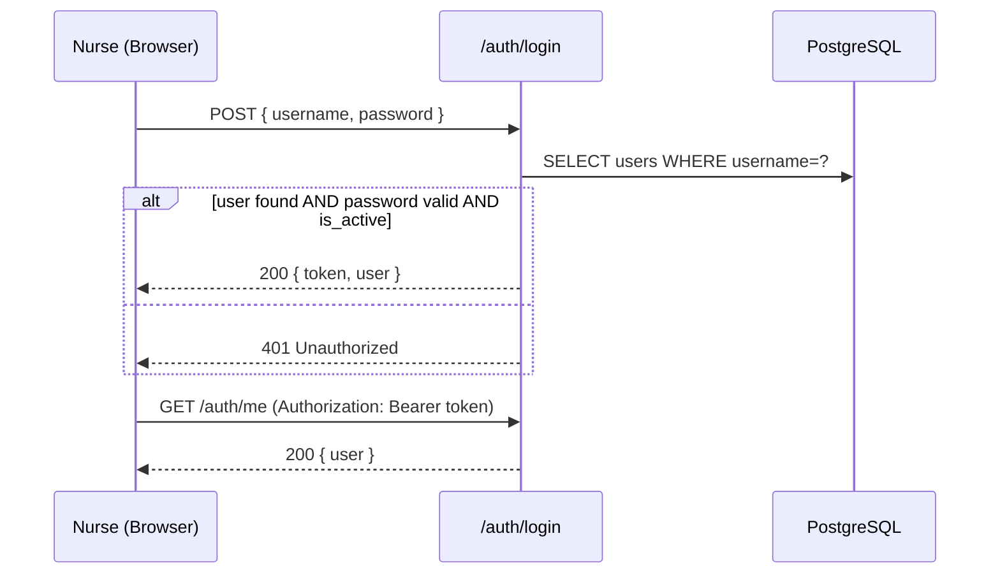
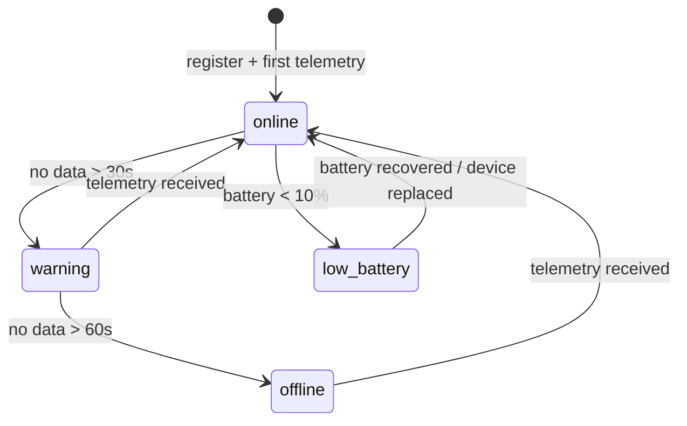
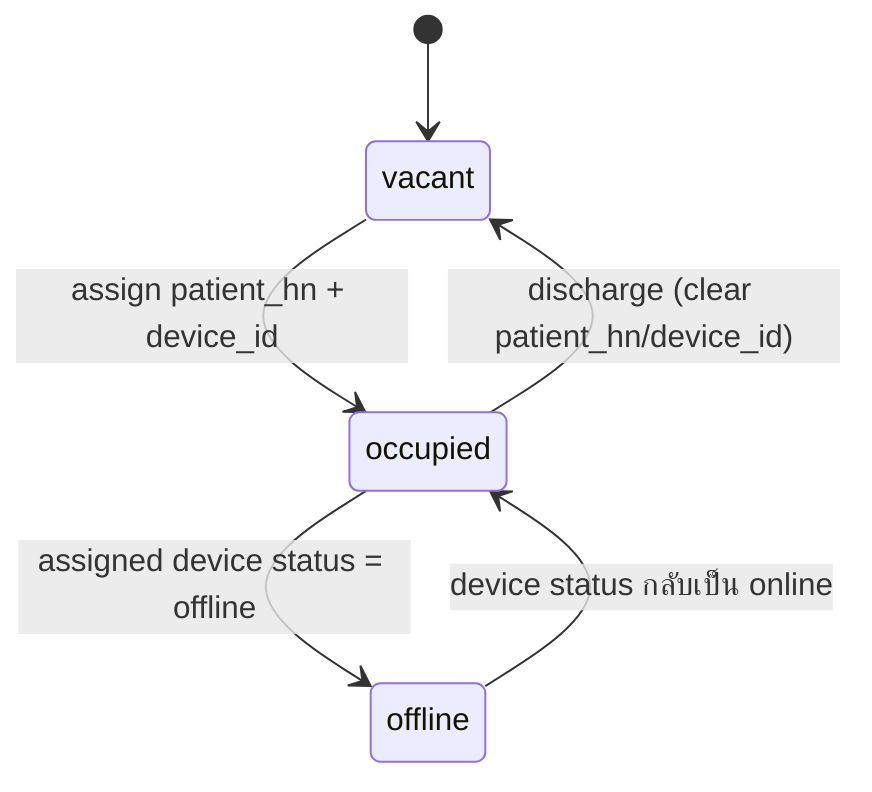
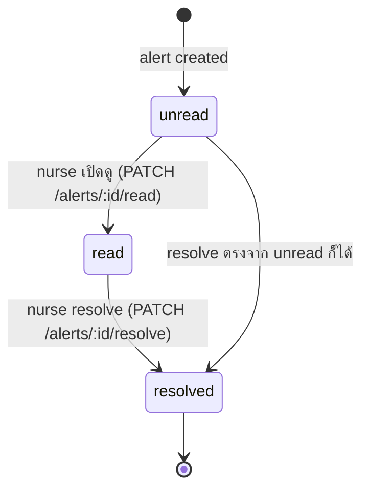

# Detailed Design — SMIS

> เอกสารนี้ไม่มีมาก่อนในเวอร์ชันก่อนหน้า — สร้างขึ้นเพื่อเติม Deliverable "Detailed Design / Sequence Diagram" ตาม [[Phase Plan]] Phase 3 (System Design) เนื้อหาอยู่ระดับ **module → algorithm → sequence/state** ซึ่งลึกกว่า [[System Architecture]] (component level) และเจาะจงกว่า [[API Specification|API]] (contract level) — ใช้เป็น reference ตรงตอน implement Sprint 1–5 ([[Sprint List]])

**อ่านคู่กับ:** [[System Architecture]] (ภาพรวม component) · [[API Specification|API]] (endpoint contract) · [[Database]] (schema เต็ม)

---

# 1. Backend Module Design

อ้างโครงสร้างจาก [[Application Architecture]] §Backend Modules — ตารางนี้ระบุ responsibility และ dependency ของแต่ละ module ให้ละเอียดขึ้นสำหรับตอน implement

| Module | Responsibility | Depends On | Feature |
|---|---|---|---|
| `ward` | Ward CRUD, aggregate bed count ต่อสถานะ | `prisma`, `bed` | FL-006 |
| `bed` | Bed CRUD, assignment (patient_hn/device_id), sort/filter query, detail drawer | `prisma`, `iv`, `device` | FL-007–011 |
| `iv` | Calculation Engine (remaining/flow/ETE/priority) + `iv_status`/`iv_readings` persistence | `prisma`, `common` (smoothing util) | FL-019–024 |
| `alert` | ตรวจเงื่อนไข alert, debounce, persist `alerts`, trigger `notification` | `prisma`, `iv`, `device` | FL-028–033 |
| `device` | Device CRUD/provisioning, offline detector (cron), telemetry auth guard | `prisma`, `common` | FL-012, FL-038, FL-015 |
| `notification` | ส่ง Telegram message ตาม alert ที่เกิด | `alert` (event listener) | FL-031 |
| `socket` | Socket.IO Gateway — subscribe event จาก `iv`/`alert`/`device` แล้ว broadcast | `iv`, `alert`, `device` | FL-016, FL-017 |
| `prisma` | Prisma Client wrapper, migration | — | FL-002 |
| `common` | Shared: smoothing (moving average), DTO validation, guards (JWT/DeviceKey), response envelope | — | — |

**หลักการออกแบบ:** `iv` module เป็นแหล่งความจริงเดียว (single source of truth) ของ Calculation Engine — `alert` และ `socket` เป็นแค่ subscriber ของผลลัพธ์จาก `iv` ไม่คำนวณซ้ำเอง เพื่อป้องกัน logic แตกกันสองที่

---

# 2. Core Algorithms

## 2.1 Remaining Volume / Percent (FL-020)

```text
input: weight_raw (g), empty_bag_weight (g, จาก calibration), initial_liquid_ml

remaining_weight_g = weight_raw - empty_bag_weight
remaining_ml        = remaining_weight_g   // ประมาณ 1g ≈ 1ml สำหรับสารน้ำ
remaining_percent   = (remaining_ml / initial_liquid_ml) * 100

clamp remaining_ml, remaining_percent to >= 0
```

## 2.2 Sensor Noise Smoothing (FL-019)

จาก [[Hardware & Firmware Architecture]] §Noise Reduction Strategy — ทำที่ฝั่ง Server เพิ่มอีกชั้น (ฝั่ง ESP32 ทำ pre-filter แล้ว):

```text
window = last 10 readings (จาก iv_readings ของ bed_id เดียวกัน)
reject reading ถ้า |reading - previous_reading| > 30g   // spike rejection
smoothed_weight = average(window ที่เหลือหลัง reject)
```

## 2.3 Flow Rate Calculation

```text
flow_rate (ml/min) = (previous_remaining_ml - current_remaining_ml) / minutes_elapsed

ถ้า flow_rate < 0 (น้ำหนักเพิ่มขึ้น ผิดปกติ) → ไม่ update flow_rate, สร้าง Sensor Error Alert
ถ้า minutes_elapsed == 0 → skip (ป้องกัน divide by zero)
```

## 2.4 Estimated Time to Empty — ETE (FL-021)

```text
ETE (minutes) = remaining_ml / flow_rate     // PRD §10.4
estimated_empty_at = now() + ETE minutes

ถ้า flow_rate <= 0 → estimated_empty_at = null (ไม่สามารถประมาณได้)
```

## 2.5 Priority Score Engine (FL-023)

```text
priority_score =
    (100 - remaining_percent) * 0.6
  + (flow_rate * 0.2)
  + (minutes_to_empty * -0.2)

priority_band:
  ETE < 15 min        → P1 Critical
  15 <= ETE < 30 min   → P2 High
  30 <= ETE < 60 min   → P3 Warning
  ETE >= 60 min        → P4 Normal
```

**Worked Example**

| Bed | Remaining % | Flow Rate | ETE (min) | Priority Score | Band |
|---|---|---|---|---|---|
| 5A-01 | 10% | 5 ml/min | 15 | (90×0.6)+(5×0.2)-(15×0.2) = 55.0 | P2 |
| 5A-02 | 20% | 3 ml/min | 30 | (80×0.6)+(3×0.2)-(30×0.2) = 42.6 | P3 |
| 5A-03 | 45% | 2 ml/min | 50 | (55×0.6)+(2×0.2)-(50×0.2) = 23.4 | P3 |

คำนวณใหม่ทุกครั้งที่มี telemetry เข้ามา (§3.1) — ไม่มี background job แยก

## 2.6 Alert Condition & Debounce (FL-028–032)

```text
on iv_status updated:
  if remaining_percent == 0            → candidate = EMPTY
  else if remaining_percent < 20       → candidate = CRITICAL_LOW
  else                                  → candidate = none

  if candidate != none:
    last_alert = most recent alert ของ bed_id เดียวกัน ชนิดเดียวกัน ที่ resolved_at IS NULL
    if last_alert exists AND last_alert.created_at within debounce_window (default 5 min):
      skip (ไม่สร้างซ้ำ)
    else:
      create alert(type=candidate, message = build_message(bed, patient, remaining, ete))
      emit "alert:new"
```

```text
on device last_seen check (cron ทุก 10s):
  if now() - last_seen > 60s AND device.status != 'offline':
    device.status = 'offline'
    create alert(type=DEVICE_OFFLINE, bed_id = assigned bed)
    emit "device:offline"
  else if now() - last_seen > 30s:
    device.status = 'warning'   // ไม่สร้าง alert, แค่เปลี่ยน status
```

`debounce_window` เป็น hard requirement ตาม PRD §12.1 (False Alert Rate) — ค่าจริงต้องยืนยันกับพยาบาลก่อน Pilot (ดู PRD §5.4)

---

# 3. Sequence Diagrams

## 3.1 Telemetry Ingestion → Alert → Broadcast (FL-015, FL-016)

```mermaid
sequenceDiagram
    participant ESP as ESP32
    participant API as NestJS API (/iot/telemetry)
    participant IV as iv module
    participant DB as PostgreSQL
    participant ALT as alert module
    participant SOCK as socket module
    participant UI as Dashboard
    participant TG as Telegram

    ESP->>API: POST /iot/telemetry (x-device-key)
    API->>API: validate device key + payload
    API->>DB: insert iv_readings (raw)
    API->>IV: calculate(remaining, flowRate, ete, priority)
    IV->>DB: upsert iv_status
    API->>DB: update devices.last_seen/battery/rssi
    API->>ALT: checkAlertConditions(bedId, ivStatus)
    alt เข้าเงื่อนไข และไม่ถูก debounce
        ALT->>DB: insert alerts
        ALT->>SOCK: emit alert:new
        ALT->>TG: send notification
    end
    API->>SOCK: emit iv:update
    SOCK->>UI: iv:update / alert:new (WebSocket)
    API-->>ESP: 200 { success, serverTime }
```

## 3.2 Device Offline Detection (FL-030)

```mermaid
sequenceDiagram
    participant CRON as Offline Detector (interval 10s)
    participant DB as PostgreSQL
    participant ALT as alert module
    participant SOCK as socket module
    participant UI as Dashboard

    loop every 10s
        CRON->>DB: SELECT devices WHERE last_seen < now()-30s
        alt now()-last_seen > 60s AND status != offline
            CRON->>DB: update devices.status = offline
            CRON->>ALT: createAlert(DEVICE_OFFLINE)
            ALT->>SOCK: emit device:offline
            SOCK->>UI: device:offline
        else now()-last_seen > 30s
            CRON->>DB: update devices.status = warning
        end
    end
```

## 3.3 User Login (FL-003)



## 3.4 Mobility Mode Toggle (FL-034)

```mermaid
sequenceDiagram
    participant N as Nurse
    participant API as /beds/:id/mobility-mode
    participant IV as iv module
    participant ALT as alert module

    N->>API: POST /start
    API->>IV: set iv_status.is_mobility_mode = true
    Note over ALT: ระหว่างนี้ Alert Engine จะ suspend<br/>Critical/Empty alert สำหรับเตียงนี้
    N->>API: POST /stop (เมื่อกลับ Ward)
    API->>IV: set iv_status.is_mobility_mode = false
```

---

# 4. State Machines

## 4.1 Device Status (FL-038, PRD §11.4)



## 4.2 Bed Status



## 4.3 Alert Lifecycle



---

# 5. Error Handling & Edge Cases

| Case | Detection | Handling | อ้างอิง |
|---|---|---|---|
| WiFi หลุดที่ ESP32 | ESP32-side (ไม่ผ่าน backend) | Firmware buffer ข้อมูลใน memory, retry connect, ส่งย้อนหลังเมื่อกลับมา online | [[Hardware & Firmware Architecture]] §Offline Mode |
| Server รับ request ไม่ได้ (down) | ESP32-side retry/timeout | ESP32 เก็บข้อมูลชั่วคราว ส่งย้อนหลังเมื่อ server กลับมา | [[Hardware & Firmware Architecture]] §Failure Handling |
| Sensor ผิดปกติ (น้ำหนักติดลบ/เพิ่มผิดปกติ/ค่าคงที่นานเกินไป) | `iv` module ตรวจใน calculation step | สร้าง Sensor Error Alert แยกจาก Occlusion, ไม่ update `iv_status` ด้วยค่าที่ผิดปกติ | §2.3, PRD §17 |
| Telemetry ซ้ำ/out-of-order (`timestamp` เก่ากว่า reading ล่าสุดใน DB) | เทียบ `timestamp` payload กับ `iv_readings.recorded_at` ล่าสุดของ bed เดียวกัน | ไม่ insert ซ้ำ ไม่ recalculate flow_rate จาก reading ที่ out-of-order | §2.3 |
| Device ส่ง `deviceId` ที่ไม่ได้ provision | `device` module lookup ไม่พบ | คืน `404`, ไม่สร้าง record ใหม่อัตโนมัติ (provisioning ต้องทำผ่าน `POST /devices` ก่อน) | [[API Specification\|API]] §5.1 |
| Flow Blockage / Occlusion (flow คาดว่ามีแต่ volume ไม่เปลี่ยน) | `iv` module: expected flow > 0 แต่ Δremaining_ml ≈ 0 ต่อเนื่องเกิน X นาที | สร้าง alert type `occlusion_suspected` ใช้คำว่า "Possible/Suspected" เท่านั้น (ห้ามยืนยันว่าเป็น occlusion จริง) | FL-033, PRD §10.6 |

---

# 6. Traceability — Feature → Design Section

| Feature ID | Design Section |
|---|---|
| FL-003 | §3.3 |
| FL-009, FL-010 | [[API Specification\|API]] §3.1 (query param) |
| FL-011 | [[API Specification\|API]] §3.3 |
| FL-015, FL-016 | §3.1 |
| FL-019 | §2.2 |
| FL-020 | §2.1 |
| FL-021 | §2.4 |
| FL-023, FL-024 | §2.5 |
| FL-028–032 | §2.6 |
| FL-030 | §3.2, §4.1 |
| FL-033 | §5 (Occlusion row) |
| FL-034 | §3.4 |
| FL-038 | §4.1 |

---

## Related

- [[System Architecture]]
- [[API Specification|API]]
- [[Database]]
- [[ER-Diagram]]
- [[Application Architecture]]
- [[Hardware & Firmware Architecture]]
- [[IoT Architecture]]
- [[Feature List]]
- [[Project Requirement Document (PRD) v2.1]]
